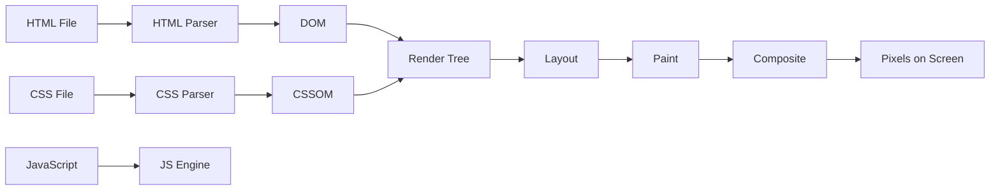
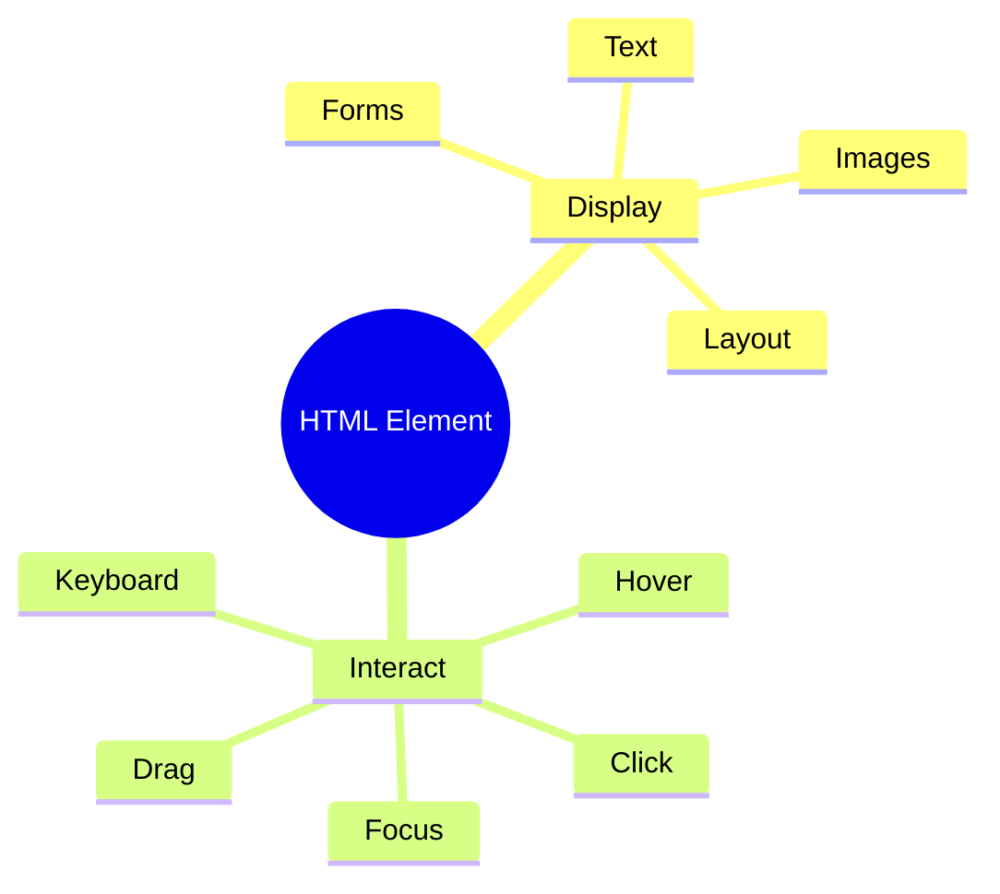
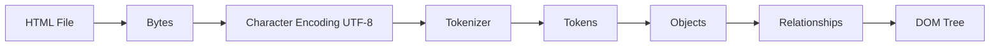
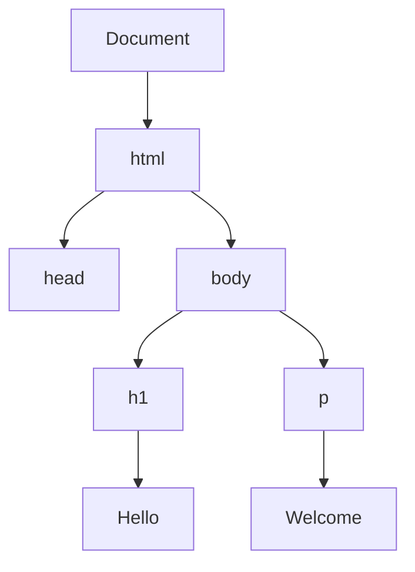
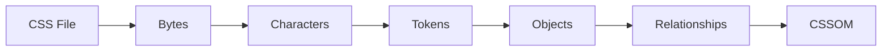
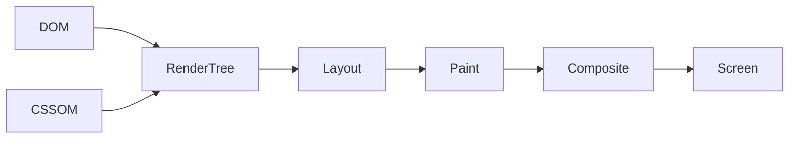
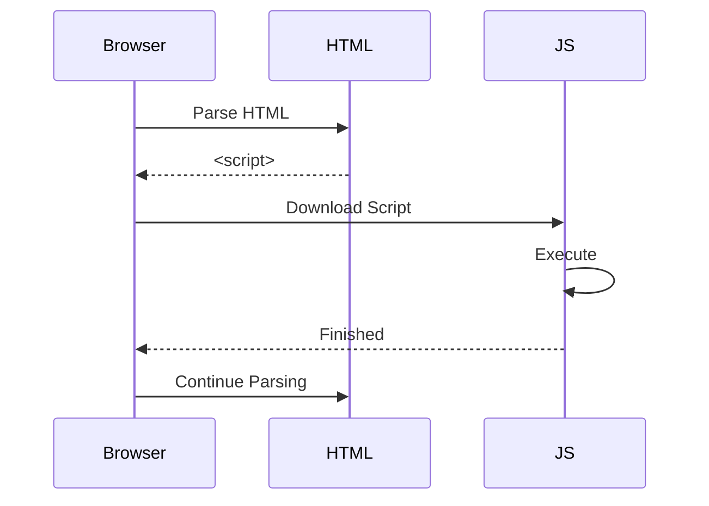
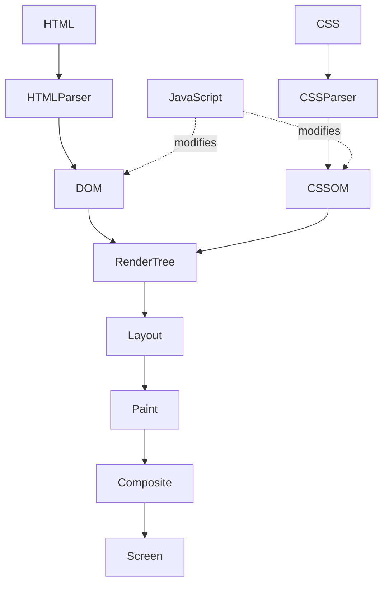

# 🌐 Browser Rendering Pipeline

> How a browser converts HTML, CSS, and JavaScript into pixels on your screen.

![[test]]

---


# Browser Architecture



---

# HTML

HTML defines the **structure** of the webpage.

Example:

```html
<h1>Hello World</h1>
<p>Welcome to my website.</p>
```

---

## Selecting Elements

```javascript
document.getElementsByTagName("p")
```

Returns an **HTMLCollection**, **not an Array**.

> Although it looks like an array, it does **not** support array methods like `map()`, `filter()`, or `forEach()` in older browsers.

To convert:

```javascript
Array.from(document.getElementsByTagName("p"))
```

---

## Every HTML Element Can



---

# HTML Parsing Process

The browser transforms raw HTML into the **DOM (Document Object Model).**



---

## Object Creation

Each HTML tag becomes an object.

```html
<h1>Youtube</h1>
```

becomes

```javascript
{
    tag: "h1",
    text: "Youtube"
}
```

These objects are then connected together as a **tree**.

---

## DOM Example



DOM stands for:

> **Document Object Model**

---

# CSS Parsing

CSS goes through almost the same pipeline.



CSSOM means:

> **CSS Object Model**

---

# Browser Rendering Pipeline

The browser combines the DOM and CSSOM before drawing anything.



---

## Rendering Stages

### 1. DOM

Structure of the webpage.

---

### 2. CSSOM

Styles for every element.

---

### 3. Render Tree

Combines:

- DOM
- CSSOM

Hidden elements (`display:none`) are removed.

---

### 4. Layout (Reflow)

Calculates:

- Position
- Width
- Height
- Margins
- Padding

Everything is converted into exact pixel positions.

---

### 5. Paint

Draws:

- Text
- Borders
- Colors
- Shadows
- Images

---

### 6. Composite

Combines painted layers using the GPU and displays the final page. (like photoshop layers combined to show final view)

---

# JavaScript and Rendering

When the browser encounters a normal `<script>` tag:

```html
<script src="script.js"></script>
```

Rendering **stops**.



---

## Important Note

JavaScript execution may also wait if the required **CSSOM isn't ready**, because JavaScript can query computed styles.

Example:

```javascript
getComputedStyle(element)
```

The browser must finish CSS parsing before returning the computed values.

---

# Script Loading Strategies

```html
<script src="app.js"></script>
```

### Comparison

| Type | HTML Parsing | Download | Execution | Best Use |
|------|--------------|----------|-----------|----------|
| **Normal** | ❌ Stops | Sequential | Immediately after download | Critical scripts |
| **defer** | ✅ Continues | Parallel | After HTML parsing | DOM manipulation |
| **async** | ✅ Continues | Parallel | Immediately after download | Analytics, Ads |

---

## Visual Comparison

```mermaid
gantt
title Script Loading Timeline
dateFormat X
axisFormat %s

section HTML
Parsing :active, 0,10

section Normal
Download :1,2
Execute :3,2

section Defer
Download :1,6
Execute :10,2

section Async
Download :1,3
Execute :4,2
```



---

# Complete Browser Pipeline



---

# Key Takeaways

✅ HTML → DOM

✅ CSS → CSSOM

✅ DOM + CSSOM → Render Tree

✅ Render Tree → Layout

✅ Layout → Paint

✅ Paint → Composite

✅ Composite → Pixels on Screen

---

# Reference Video

<iframe
width="560"
height="315"
src="https://www.youtube.com/embed/5rLFYtXHo9s?si=CJiE4IY83MF6DLWQ"
title="YouTube video player"
frameborder="0"
allowfullscreen>
</iframe>